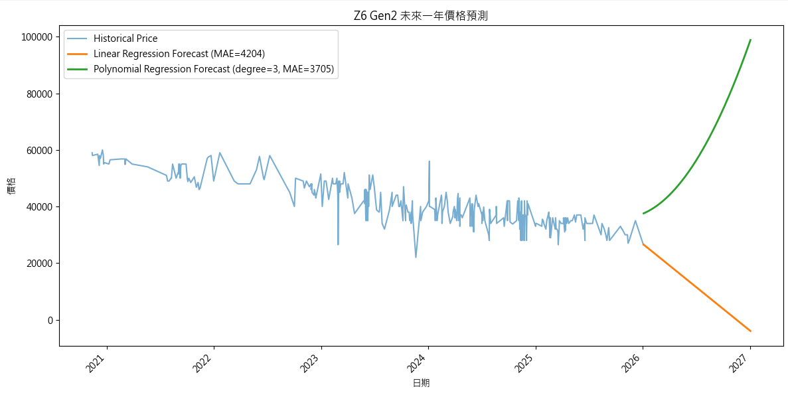
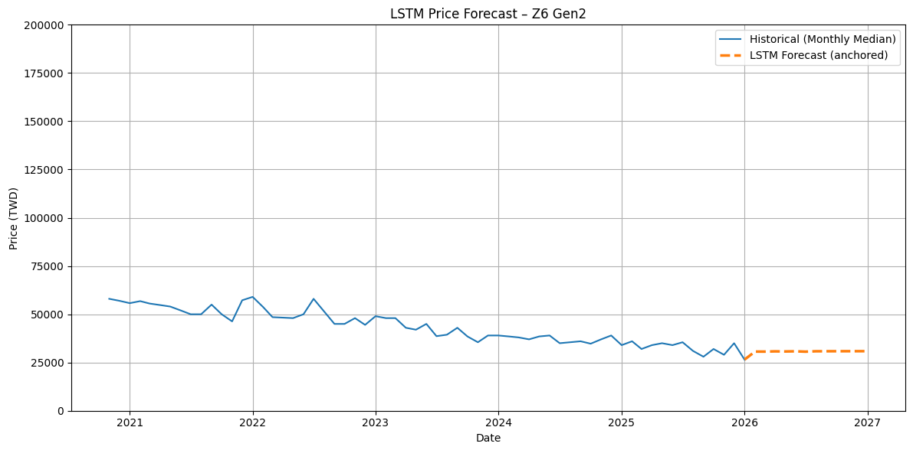
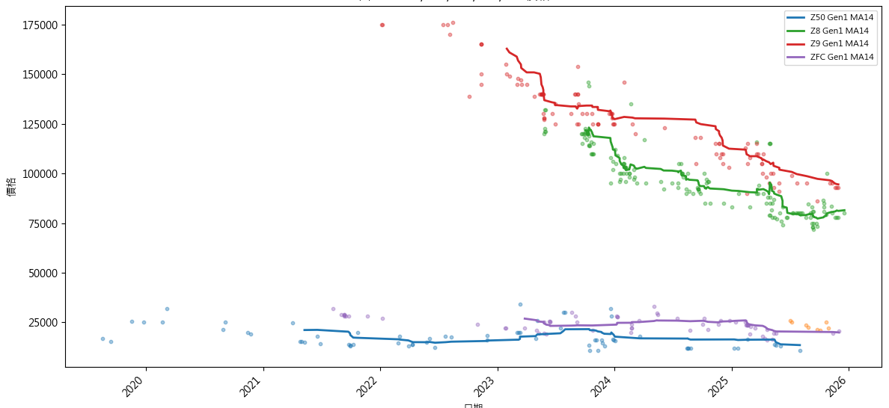
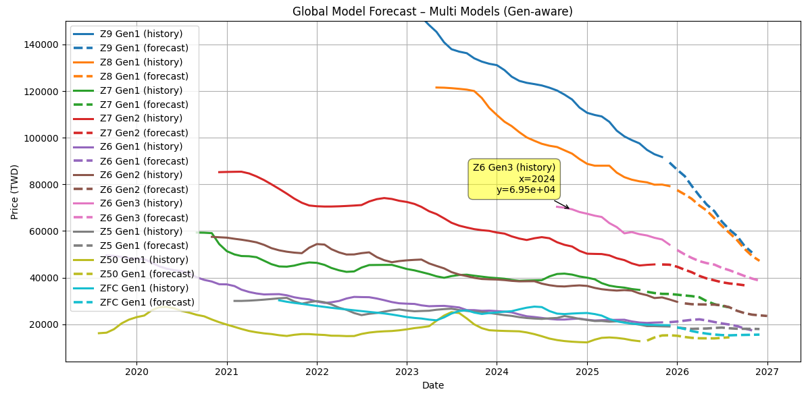
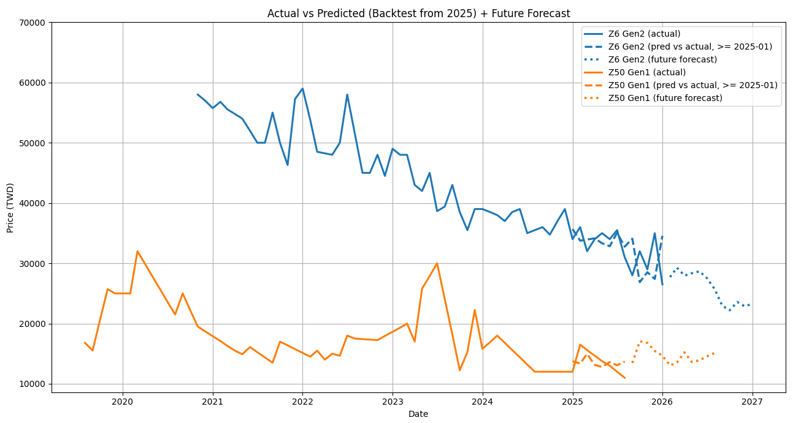

# 數位相機二手市場價格趨勢預測及分析

## 說明
### 專案簡介
本專案針對數位相機二手市場的價格變化進行分析，透過蒐集歷史交易資料，觀察不同機型的價格走勢，嘗試建立模型預測未來一年的價格變化。專案著重於實際資料處理流程與分析結果呈現，作為二手相機市場趨勢觀察的實作範例。

> ⚠️ **開發中（Work in Progress）**  
> 本專案為小小 Side Project，目前仍在持續開發與完善階段 ^_^

---

### 專案目標
- 整理並分析數位相機二手交易價格資料  
- 建立可預測未來一年價格走勢的模型  
- 以視覺化方式呈現歷史與預測結果
- 最終提供二手相機或新機購買時機參考  

---

### 資料來源與說明
本專案資料來源為數位影像專業社群網站 DCView。依據 http://market.dcview.com/robots.txt 之規範，該網站未對本專案所使用之頁面設置全面性之爬蟲存取限制。本研究僅於合理頻率下進行資料擷取，避免高頻請求，並僅作為學術研究與資料分析用途，充分尊重並遵守網站之使用規範。

在初期測試階段，蒐集自 2017 年至今，標註為 Nikon 相關之二手相機刊登資料，約六萬筆，作為模型與資料處理流程之最小可行測試集。

---

### 資料集介紹
資料處理流程包含以下步驟：
1. 原始資料經擷取後，拆分為以下欄位：
[brand,status,trade_type,region,title,price,user,date,link] 

2. 資料過濾與機型分類 
使用 `data_check.py` 透過關鍵字比對與規則篩選，將原始標題（title）轉換為一致性的商品標籤，例如：[z5gen1, z5gen2, z6gen1, …]，以降低人工標題差異與配件、套機、非機身商品對後續分析造成的影響。

3. 分離資料離群值
使用 `data_outlier.py` 對同一機型與世代之價格資料進行離群值分離，以減少極端價格對整體趨勢分析與預測模型之影響。過濾後資料將作為後續價格分析與模型訓練之主要依據。

以下為經三步驟處理後的各數位相機機型資料數量圖

---

### 資料集分析

1. 主要使用camera_model、generation、price、date進行分析，其他欄位做後續備用。在選定的欄位中，price 為主要分析與預測之目標欄位，其餘選定欄位作為輔助分析與特徵來源。

2. 特徵（X）與預測目標（y）定義
為進行價格趨勢預測，本專案將問題定義為監督式回歸預測問題，其中特徵與目標定義如下：
    - 預測目標（y）price：二手相機之價格
    - 特徵（X）:
        - time_index：由日期轉換而成之時間索引，用以描述價格隨時間變化之趨勢
        - generation：相機世代，用於區分不同世代產品之價格結構

3. 特徵縮放（Standardization）
本專案主要模型為回歸模型，若特徵僅使用 `time_index`（時間索引）則尺度單一，對模型影響有限，因此回歸訓練可不強制縮放。  

### 模型訓練及預測
首先嘗試以線性回歸與多項式回歸模型，利用單一機型之歷史價格資料進行未來價格預測。結果顯示，當進行長期外推時，模型容易產生不合理的趨勢延伸，且預測誤差偏大。

隨後改以 LSTM 進行時間序列預測。雖能捕捉短期序列變化，但在樣本數有限且價格波動高度離散的情況下，模型傾向輸出變動幅度極小之平滑預測結果，整體預測穩定性仍有限。

資料分析顯示，二手價格走勢可依機型定位與產品世代呈現群聚特性。Zfc 與 Z50 形成一組相似走勢群，而 Z8 與 Z9 則形成另一組；此外，同一產品線之不同世代機型（Z6、Z6 II 與 Z6 III）亦呈現高度相近的價格變化趨勢。

相對地，不同市場定位群集之間，其價格行為模式差異明顯。此結果顯示，具相似市場定位或同系列演進關係之機型，可在建模時共享其價格行為特徵。

### Global Model 建模策略

基於上述觀察，本專案進一步調整建模策略，改採跨機型之全域共同模型（Global Model），
將多個市場定位相近之機型與世代的價格行為納入同一訓練架構中，
並引入時間指標、價格延遲（lag）、移動平均（moving average）以及同系列新機上市影響等特徵。

模型訓練與驗證採用時間序列切分（time-based split）方式進行。
以資料中最晚月份為基準，保留最近 6 個月作為驗證集，其餘較早之歷史資料作為訓練集，
以避免未來資訊洩漏（data leakage）問題。

模型以「預測下一個月價格」作為學習目標（one-step-ahead forecasting），
藉此評估模型於接近實際市場時間點時的預測能力。

此策略之核心目的在於於資料有限的情況下最大化可用資訊，
以提升模型穩定性與整體預測表現。
實驗結果顯示，相較於單一機型模型，
全域模型於價格趨勢預測上展現出較佳之一致性與合理性。

### 模型可用性評估（Evaluation）

本專案以時間序列切分方式進行模型驗證，
保留最近 6 個月資料作為驗證集，
以評估模型於接近實際市場時間點時之預測表現。

評估指標採用平均絕對誤差（Mean Absolute Error, MAE），
用以衡量模型對「下一個月二手價格」之預測誤差幅度。

實驗結果顯示，全域模型於驗證期間能維持穩定之誤差表現，
其預測誤差落於二手相機市場價格波動可接受之範圍內，
Validation MAE ≈ 4,756 TWD (last 6 months)
顯示該模型具備作為價格趨勢分析與輔助參考之可用性。

下圖以兩款具代表性之機型作為範例，
呈現 2025 年以後模型預測結果與實際價格走勢之比較，
可觀察到預測曲線在整體趨勢上與實際變化具有高度一致性。

### 使用場景（消費者應用）

本專案之模型主要用於協助消費者理解二手相機市場之價格變化趨勢，
並作為購買或出售決策前的輔助參考工具，
而非即時定價或交易建議系統。

1. **購買時機判斷輔助**  
   消費者可透過模型所呈現之價格趨勢，
   觀察特定機型是否處於價格緩慢下修、盤整或趨於穩定之階段，
   作為判斷「是否適合近期入手」的參考依據，
   以避免在價格尚未穩定時過早購買。

2. **二手售價合理性評估**  
   對於有出售需求的使用者，
   模型所提供之趨勢可協助評估目前市場價格是否已接近低點或相對穩定區間，
   作為設定合理出售時機與心理價格區間之輔助資訊。

3. **跨機型與世代比較**  
   透過同系列不同機型或世代之價格趨勢比較，
   消費者可了解各機型在時間推移下之保值性差異，
   有助於在購買時於「性能需求」與「價格折舊」之間取得平衡。

4. **避免短期價格波動誤判**  
   由於二手市場價格常受個別賣家與短期事件影響，
   本專案之模型可提供中期趨勢視角，
   協助消費者避免因短期價格波動而做出過度反應之決策。

### 未來工作

儘管本研究之實驗結果顯示模型於驗證期間具備良好之預測表現，
仍無法完全排除模型主要學習到長期價格趨勢，
而非真正掌握市場中更細緻之價格變動機制。
由於二手相機價格本身變動相對緩慢，
短期內價格差異往往不明顯，
模型在部分情境下可能僅呈現趨勢擬合效果。

未來可透過擴充資料來源以提升模型可辨識性，
例如整合多個二手交易平台之價格資訊，
並加強資料清洗與內容過濾流程。
進一步可嘗試引入大型語言模型（LLM），
用於解析與過濾非結構化文字內容，
以提取更具判斷力之市場訊息。

此外，後續研究可納入更多與實際交易相關之特徵，
例如快門數、機身狀況、配件完整度、新機定價變化等，
並嘗試建構心理關口（psychological price level）等行為性特徵，
以提升模型對中長期價格走勢之理解能力與預測穩定性，
進而支援更具前瞻性之價格分析。

## 原始程式碼說明

### 資料及準備

1. 執行`get_price_from_DCView.py` 於**DCView**中取得Nikon標籤頁面中1~3000頁的貨物資訊。每頁20項，共60000筆，並存入`dcview_nikon.csv`

2. 執行`data_check.py` 用於讀取`dcview_nikon.csv`並選出所有匹配**相機清單的**項目，再移除包含指定敏感詞的項目，用於過濾包含鏡頭、濾鏡等非單機身項目。

3. 執行`data_Outlier.py` 用於移除離群值，同時移除DSLR機型(僅用於本次最小實驗)

